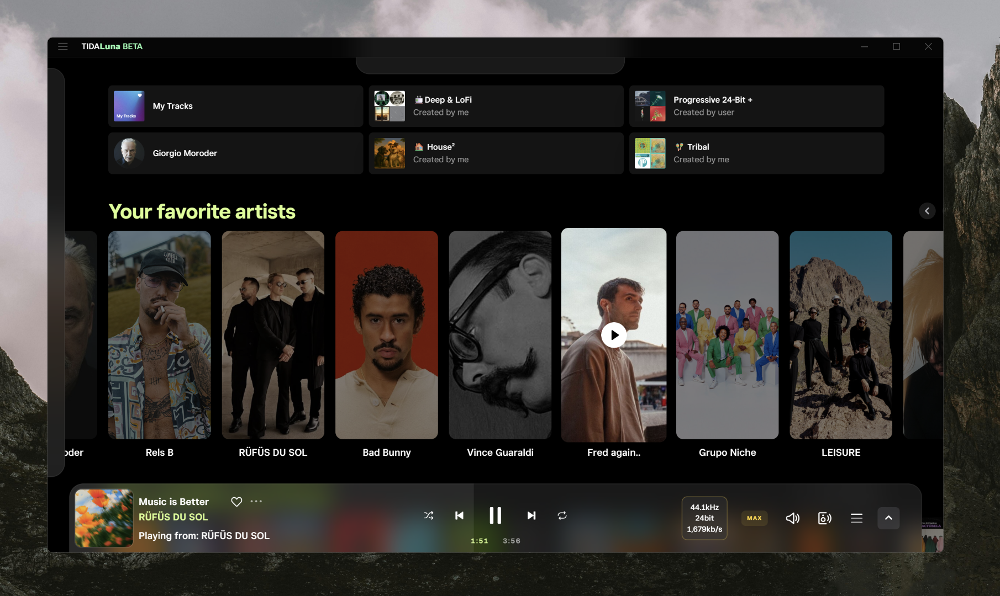
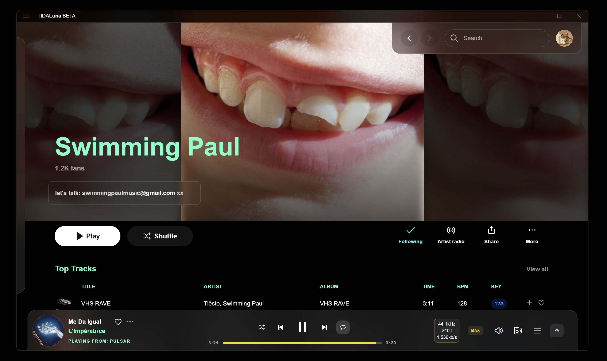

# Lunallena 🌕

A theme for **Tidaluna** featuring elegant blur, UI tweaks and effects.
Designed to work with Sidebar 3.0.

---

https://github.com/user-attachments/assets/70801188-6560-4275-ae0a-af5ed157edd1

---

## Installation Guide

Follow these steps to get Lunallena up and running:

1.  **Install Luna Client Mod:**
    Run the Luna client mod installer. If you don't have it yet, you can download it here:
    * [**Download Luna Installer**](https://github.com/Inrixia/TidaLuna)

2.  **Open Luna Settings:**
    After installing, open Tidal, click the **three-dot menu** next to your profile icon, and select **Luna settings**.

3.  **Install Themer Plugin:**
    Go to the **Plugin Store** tab, scroll down until you find **Themer**, and click install.

4.  **Apply Theme:**
    Press `Ctrl + E` to open the theme input box and paste the [Lunallena.css](https://github.com/Acercandr0/Lunallena/blob/main/Lunallena.css) code.

---

## How to Enable Sidebar 3.0

Lunallena is specifically tweaked for the new sidebar. To activate it:

1.  Open **Luna Settings** (Three-dot menu > Luna settings).
2.  Navigate to the **Experiments** or **Features** tab (depending on your Luna version).
3.  Look for **Sidebar 3.0** and toggle it to **Enabled**.

---

## 🧉 Made with cariño by [@Acercandr0](https://github.com/Acercandr0)
Enjoy it. Fork it. Remix it. Make it yours.
