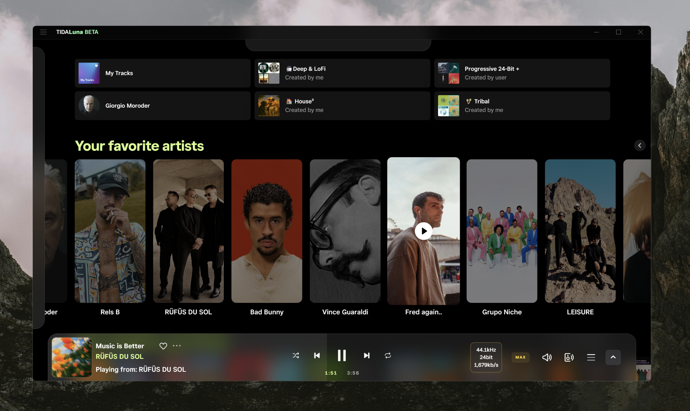
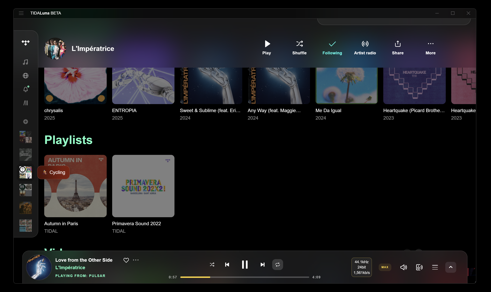
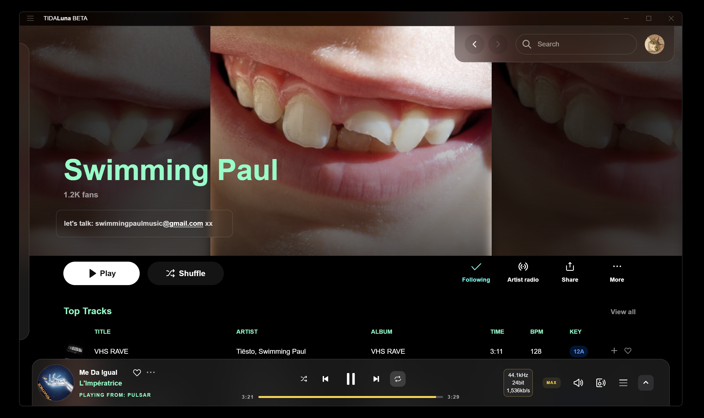
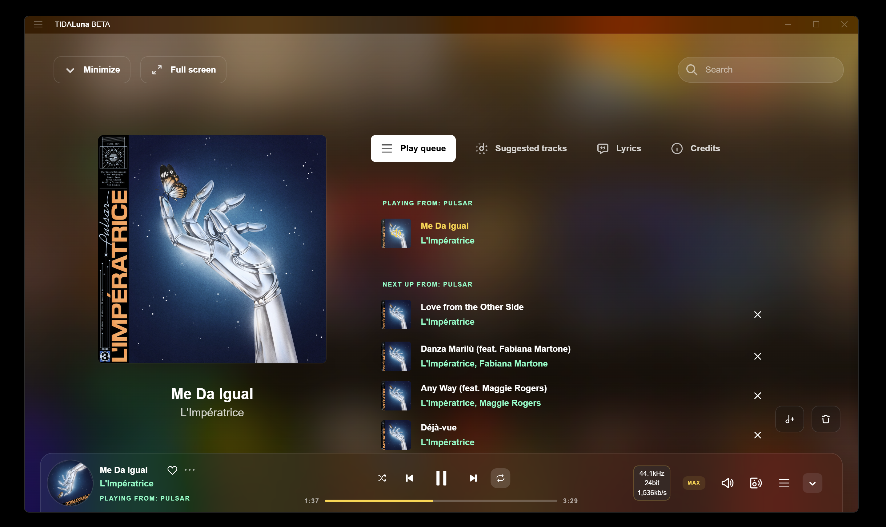

# Lunallena - Fixed 

"Full moon" Experience for Tidal (web and desktop app).
A minimalist, immersive, and elegant interface.

- **Auto-hide:** Sidebar & header are hidden by default (they pop up on hover).
- **Fully Customizable:** CSS variables allow you to tune colors and effects to your liking.
- **Glassmorphism:** A clean, modern "frosted glass" aesthetic.







---

## Installation (With Tidaluna)

The best way to experience **Lunallena** on the desktop client.

1.  **Install Luna Client Mod:** Run the installer. If you don't have it:
    * [**Download Luna Installer**](https://github.com/Inrixia/TidaLuna)
2.  **Open Luna Settings:** In Tidal, click the profile icon and select **Luna settings**.
3.  **Apply Theme:** * Go to the **Themes** tab in Luna Settings.
    * Click on **Add Theme**.
    * Paste the following **Raw URL**:
```text
https://raw.githubusercontent.com/Acercandr0/Lunallena/main/Lunallena.css
```
---

## 🧉 Made with cariño by [@Acercandr0](https://github.com/Acercandr0)
Enjoy it. Fork it. Remix it. Make it yours.
